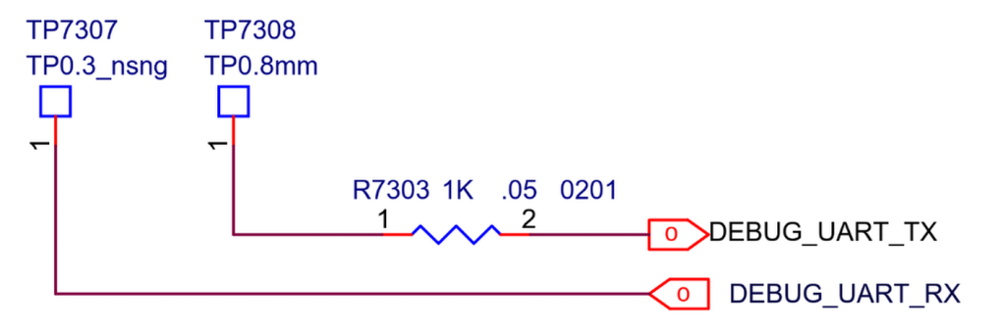
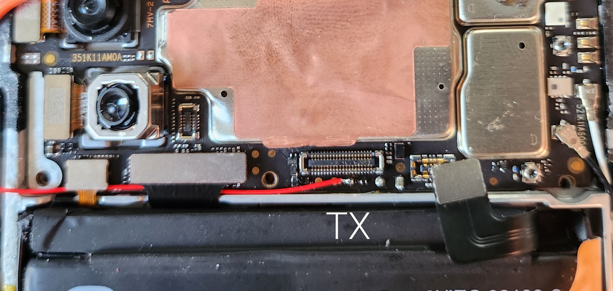
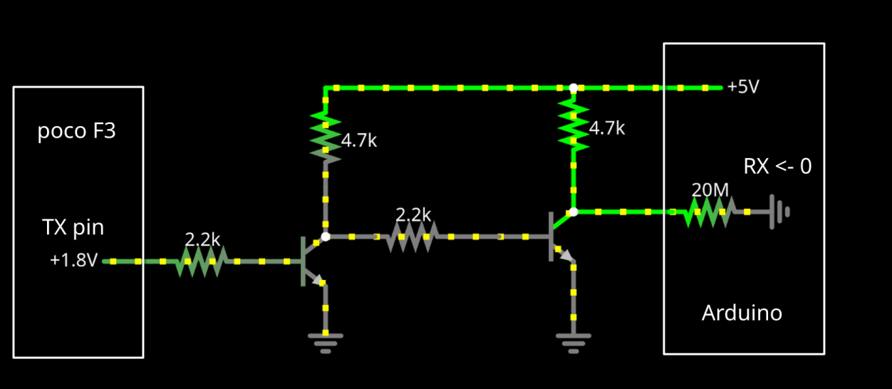
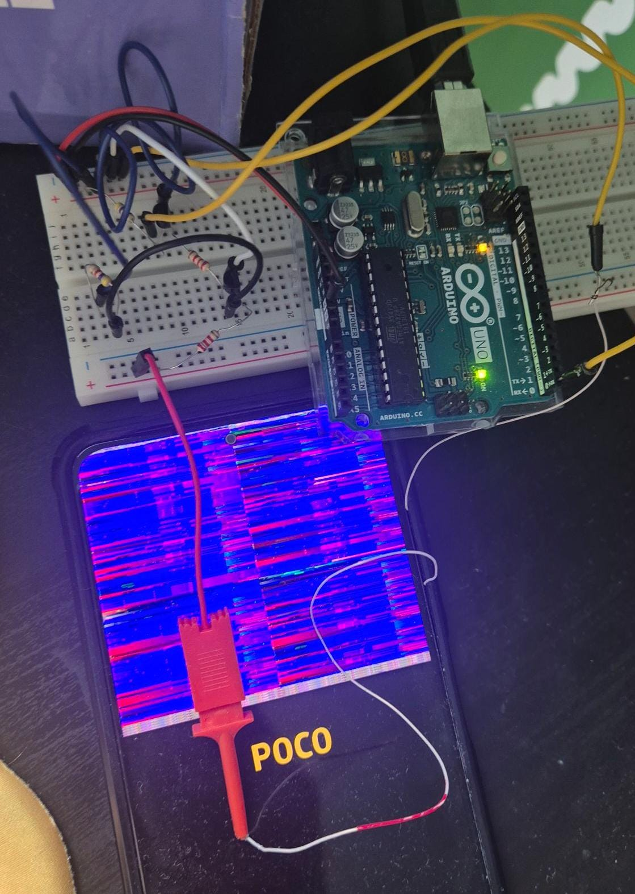

**pmaport for xiaomi poco f3 - alioth**

**Table of Contents**
- [1. Innstallation guide](#1-innstallation-guide)
- [2. Current State](#2-current-state)
- [3. Introduction](#3-introduction)
- [4. Getting the Kernel to Work](#4-getting-the-kernel-to-work)
  - [4.1. Key Config Changes from nikroks defconfig:](#41-key-config-changes-from-nikroks-defconfig)
- [5. Getting UART Logs](#5-getting-uart-logs)
  - [5.1. Kernel UART Configuration](#51-kernel-uart-configuration)
  - [5.2. Finding UART Pins on the Phone's PCB](#52-finding-uart-pins-on-the-phones-pcb)
  - [5.3. UART to USB-A Converter with Level Shifter from NPN Transistors](#53-uart-to-usb-a-converter-with-level-shifter-from-npn-transistors)
  - [5.4. Arduino Code](#54-arduino-code)
  - [5.5. Capturing the Logs](#55-capturing-the-logs)

---
# 1. Innstallation guide

After building the device with systemd:
```
fastboot erase dtbo_b
pmbootstrap flasher flash_rootfs --partition userdata
pmbootstrap flasher flash_kernel --partition boot_b
fastboot set_active b
fastboot reboot
```

Needs reboot after first boot, because of the issues with GUI.

# 2. Current State
Device was built and tested with plasma-mobile UI with systemd.

It works without major issues, most importantly WiFi with `nmtui` is available.

Little cranky at times, TODO:
 - Fix why **the phones needs to be rebooted after flashing** because GUI doesnt want to start
 - Fix `KWindow` as it crashes frequently
 - Verify which defconfig options are needed
  

Done:
 - ~~Enable bluetooth - disabled to enable UART debugging~~
 - ~~Changed NetworkManagers powersave option - changed powersave to 2 in NetworkManager for better responsivness~~


# 3. Introduction
This phone uses qcom sm8250 CPU and adreno650 GPU, so the port was based on existing postmarketOS work for this chip. Good starting point: [Xiaomi Mi Pad 5 Pro (xiaomi-elish)](https://wiki.postmarketos.org/wiki/Xiaomi_Mi_Pad_5_Pro_(xiaomi-elish))

I also found this [alioth pmaport by nikroks](https://github.com/mainlining/pmaports/tree/nikroks/alioth), but for some reason it crashes straight back to fastboot.

Good guy @Maledict found that defconfig from Mi Pad 5 Pro worked with [linux fork by nikroks](https://github.com/mainlining/linux/tree/nikroks/alioth).

We can call this our starting point.

# 4. Getting the Kernel to Work

The nikroks kernel had potential but needed some config tweaking. Started with the basic setup:
```bash
source envkernel.sh
make defconfig sm8250.config
```
 All changes were made with `make menuconfig`.

The first thing I checked was the CPU architecture of the Poco F3: it uses **Cortex A77** and **Cortex A55** cores. According to the [ARM manual](https://developer.arm.com/documentation/101111/0101/AArch64-System-registers/ID-AA64MMFR2-EL1--AArch64-Memory-Model-Feature-Register-2--EL1?lang=en) these cores support 48 bit virtual addresses and do not implement LVA (Large Virtual Addressing). The relevant ID register field:

```
 VARange, [19:16]

    Indicates support for a larger virtual address. The value is:

    0x0
        VMSAv8-64 supports 48-bit virtual addresses. 
```

Based on this, I changed the kernel configuration to match the hardware capabilities:
- `CONFIG_ARM64_VA_BITS` to 48
- `CONFIG_PGTABLE_LEVELS` to 4

It seems it should also have `CONFIG_ARM64_ERRATUM_2441007=y`, but didn't change it yet.

MMC doesn't seem needed since we only have UFS memory, so disabled `CONFIG_MMC`. Same deal with `CONFIG_ATA`.

Phone has GPU so DRM should work - adreno650 support is there.

## 4.1. Key Config Changes from nikroks defconfig:
```
CONFIG_ARM64_VA_BITS to 48
CONFIG_PGTABLE_LEVELS to 4

changed zstd compression support
changed preempt to none
changed i2c_slave to no
changed null_tty to y

CONFIG_DM_INTEGRITY to y
CONFIG_UDF_FS to y
CONFIG_XFS_FS to y
CONFIG_CRYPTO_MD4 to y
CONFIG_USB_MASS_STORAGE to n
CONFIG_ANDROID_BINDERFS to n
CONFIG_ZRAM_BACKEND_ZSTD to y

!!!! CONFIG_EFI_ZBOOT to n !!!! <-- THE IMPOSTOR
```

*The breakthrough:* After changing `CONFIG_EFI_ZBOOT` to `n`, it started working! Since the phone is missing EFI, this part was never being decompressed - and that was the biggest issue with the config. UART logs showing missing DTB pointed at the decompression issue and further confirms that the phone doesn't have EFI.

# 5. Getting UART Logs

UART logs were configured before the elish defconfig was discovered as working. Because the nikroks defconfig failed pretty early, the only logs visible in early work were **Android BootLoader (ABL) logs**, which is still cool. 

 - Dumps can be found [here](Notes/uart_logs).

## 5.1. Kernel UART Configuration
**Device Tree:** The kernel DTB must be patched to designate the appropriate UART interface as serial0 output, as demonstrated in [this patch](linux-postmarketos-qcom-sm8250-alioth/0001-modified-dts-to-see-kernel-data-on-uart.patch).

**Kernel Command Line:** The following parameters enable comprehensive UART logging: \
`deviceinfo_kernel_cmdline="console=ttyMSM0,115200n8 earlycon earlyprintk loglevel=15 console=tty0"`

Where:
 - `console=ttyMSM0,115200n8` - Primary UART console at 115200 baud. MSM is qcom specific
 - `earlycon` - Enable early console during boot initialization
 - `earlyprintk` - Enable early kernel printk messages
 - `loglevel=15` - Maximum kernel log verbosity (debug level)
 - `console=tty0` - Mirror output to virtual terminal (phone's screen)

## 5.2. Finding UART Pins on the Phone's PCB

[pmOS wiki for xiaomi poco F3](https://wiki.postmarketos.org/wiki/Xiaomi_POCO_F3_(xiaomi-alioth)) already contains info about UART TX location.

To verify it I looked for the phone schematic on yandex and [found it here](https://vk.com/wall-203976641_3526) (but it can contain viruses, use at your own risk).

|  |  |
| ------------------------------------------- | -------------------------------------- |
| _UART pins described on phone's schema_      | _UART TX location on the PCB_          |

We don't really need RX for reading logs. Also according to the PCB schema, RX pin (TP7307) is located on the other side of the PCB which would require disassembling the whole board.

So I decided to solder a wire to the UART TX pin only, and for ground I connected GND to the phone’s metal chassis, which is tied to the board's ground. Example image from pmOS wiki:
|  |
| ------------------------------------------------ |
| _UART TX marked on the poco F3 PCB_              |

## 5.3. UART to USB-A Converter with Level Shifter from NPN Transistors

I didn't have a UART to USB-A converter so I had to get creative. Found an _Arduino UNO R3_ which by default communicates with the computer via UART protocol on pins 0 and 1.

**Be careful:** if anything is plugged into pins 0 or 1, flashing can fail. Keep this in mind when uploading code.

**The voltage problem:** After checking with multimeter, the phone's UART works on **1.8V** while Arduino's logic works on **5V** (possibly could work with 3.3V). So I had to design a level shifter from what was available.

In my Arduino kit I found a few [NPN transistors BC547B](https://www.farnell.com/datasheets/410427.pdf) - their specs were fast enough for 115200 bit/s, so I used them to create this level shifter:

|        |
| -------------------------------------------------------------- |
| _Level shifter with transistors as if connected to the device_ |

**Don't forget to connect phone's ground to Arduino's ground, for the same reference point.**

Final working connection:
|  |
| --------------------------------------------------------- |
| _Phone connected to the arduino via level shifter_        |

## 5.4. Arduino Code

Simple passthrough from RX to TX:
```cpp
String receivedMessage;

void setup() {
  Serial.begin(115200);
  Serial.print("UART adapter begin:\r\n");
}

void loop() {
  while (Serial.available() > 0) {
    char receivedChar = Serial.read();

    if (receivedChar == '\n') {
      Serial.println(receivedMessage);  // Print the received message in the Serial monitor
      receivedMessage = "";  // Reset the received message
    } 
    else {
      receivedMessage += receivedChar;  // Append characters to the received message
    }
  }
}
```

## 5.5. Capturing the Logs

Connect arduino to the computer and listen via `minicom`, logs will be saved to uart_logs.txt file:
```bash
minicom -b 115200 -D /dev/ttyACM0 -C uart_logs.txt
```

